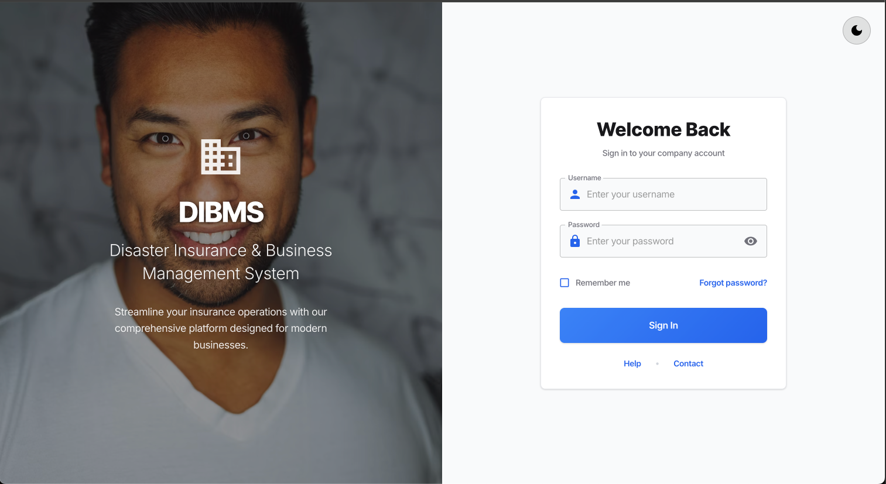
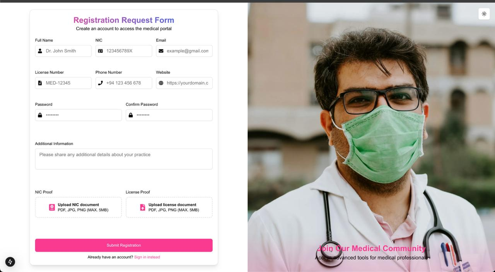
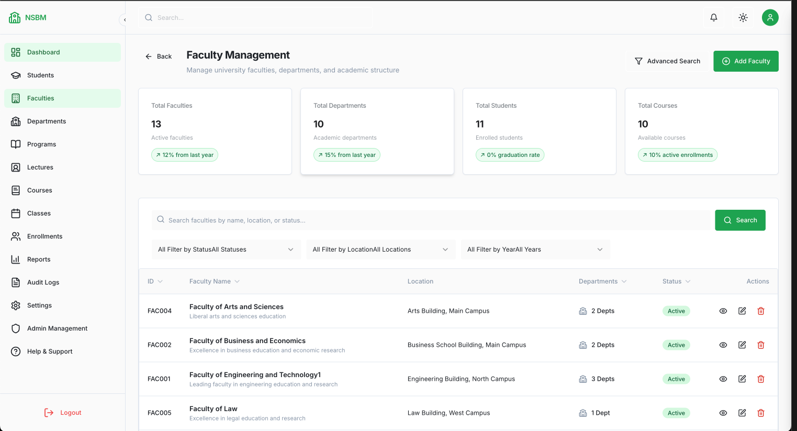
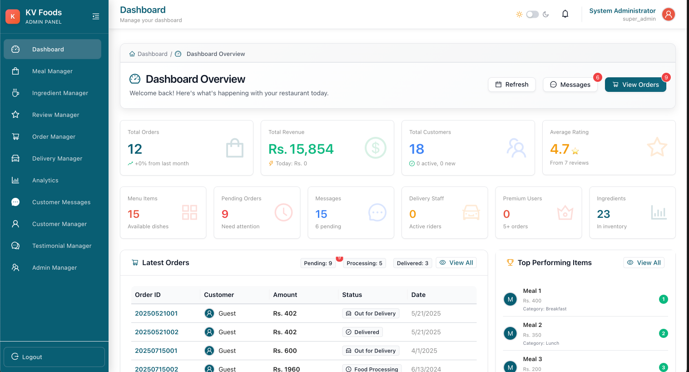

  

  

  

 

---

## 👋 About Me

Undergraduate Full-Stack Software Engineer from **Sri Lanka** 🇱🇰 with **1+ year** of experience building web and mobile applications using React.js, Next.js, Angular.js, Flutter, Spring Boot, Node.js, and .NET. Proficient in Backend Development, RESTful API development, CI/CD pipelines, and Docker containerization. Skilled in Agile methodologies and delivering scalable solutions with measurable business impact.

- 🎓 **BSc Software Engineering** @ NSBM Green University (2022-2026)
- 🚀 **Specialization:** Enterprise Systems, Microservices, RBAC Systems
- 🌱 **Learning:** AWS Solutions Architecture, Advanced AI/ML Integration
- 📫 **Reach me:** kavindukaveesha16@gmail.com | +94-771-235-703

---

## 💼 Experience

### Vihi IT Solutions | Part-Time Full Stack Developer

- Built enterprise insurance platform serving **50+ daily users** with React, Redux, Node.js, MySQL
- Designed RBAC system protecting financial data across **5 departments**
- Created Dynamic Form Builder managing **1,000+ policy records** with 16+ field types
- Achieved **70% reduction** in form creation time

### Perporva (Pvt) Ltd | Full Stack Developer (Contract)

- Upgraded YanLanka Bus Tracking System with Flutter mobile app & Laravel dashboard
- Implemented secure OTP authentication handling **1,000+ monthly sessions**

### Freelance Developer

- Delivered **10+ production applications** with **98% client satisfaction**
- Technologies: React, Spring Boot, Laravel, Flutter

---

## 🚀 Featured Projects

<table>
<tr>
<td width="50%" valign="top">

### 🏥 DIBMS Enterprise System
**React • Redux • Node.js • MySQL • Docker**

Enterprise insurance management platform with:
- Multi-level RBAC with zero security breaches
- Dynamic policy forms with 16+ field types
- 50+ daily users, 1,000+ records managed
- 70% faster form creation

</td>
<td width="50%" valign="top">

### 💊 Drug Import Platform
**Spring Boot • Next.js • PostgreSQL • Docker**

Pharmaceutical supply chain solution:
- Multi-role workflow with 95% response rate
- Automated tracking for 200+ medications
- 25% reduction in waste via expiry monitoring
- Connecting 1,000+ patients with importers

</td>
</tr>
<tr>
<td width="50%" valign="top">

### 🎓 University Management System
**Next.js • Node.js • MySQL • Docker**

Complete academic management solution:
- Managing 2,000+ student records
- 100% course conflict prevention
- 50% reduced administrative workload
- [**Live Demo →**](https://ums-sandy.vercel.app/)

</td>
<td width="50%" valign="top">

### 🍽️ Restaurant Management Platform
**React • Node.js • MongoDB • Docker**

MERN dashboard for healthy meal ordering:
- Nutritional tracking for 200+ menu items
- Real-time order processing (100+ daily)
- 50% reduced customer inquiries
- 30% faster order fulfillment

</td>
</tr>
</table>

  

---

## 🛠️ Tech Stack

### Languages

### Frontend

### Backend

### Mobile

### Database & Cloud

---

## 📊 GitHub Stats

  
  

  

  

---

## 🎓 Education & Certifications

**BSc (Hons) Software Engineering** — NSBM Green University *(2022-2026)*

**Certifications:**
- Machine Learning Specialization — DeepLearning.AI
- Docker Essentials — KodeKloud
- Data Structures & Algorithms with Java — Coursera
- Backend Development for .NET — Coursera

---

## 🤝 Let's Connect

**💼 Open for:** Freelance Projects • Full-time Opportunities • Technical Collaborations

---

  
  
  **Made with ❤️ by Kavindu Kaveesha**
  

